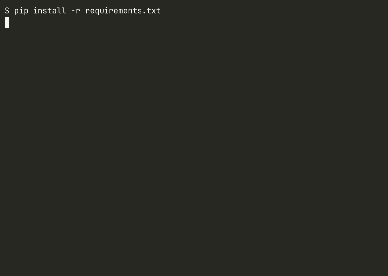

# claude-agent-worker

Use your **Claude Max subscription** as a local API. No API keys, no per-token billing, no surprises at the end of the month.

`claude-agent-worker` is a small FastAPI server that wraps the [Claude Code CLI](https://claude.ai/claude-code) and exposes it over HTTP in the OpenAI chat completions format. Any app or script that already talks to OpenAI can point here instead and run on your Claude Max subscription for free.

**Starting the server**



**Making a request**


## Why bother

Anthropic gives you two ways to use Claude programmatically:

| | Claude API | Claude Max + this worker |
|---|---|---|
| Billing | Pay per token | Flat monthly subscription |
| Auth | API key | OAuth (browser login) |
| Good for | Production, high volume | Personal tools, local dev |
| Setup | Add card, manage keys | Run `claude login` once |

If you already pay for Claude Max and you are building personal tools, scripts, or local AI features, every call through this worker costs you nothing extra. The CLI uses the same OAuth session as claude.ai in your browser, so there are no separate credentials to manage.

## How it works

```
Your app
    |
    v
POST /v1/chat/completions
    |
    v
claude-agent-worker  (this server)
    |
    v
Account pool  (least-active-connections routing)
    |
 ---+---+---
 |      |      |
acct1  acct2  acct3  (each with own HOME and semaphore)
    |
    v
claude -p ...  (CLI subprocess per account)
    |
    v
Claude Max via OAuth  (your subscription)
```

The worker takes in an OpenAI-format request, picks the account with the fewest active requests, converts the messages to the `Human:` / `Assistant:` format Claude expects, runs the CLI, and hands back a response shaped exactly like what the OpenAI SDK expects.

## What you can build with it

- **Personal scripts** that summarize, rewrite, classify, or extract data without paying per call
- **Local CLI tools** backed by Claude, running entirely on your machine
- **LangChain or LlamaIndex apps** where you just swap the base URL and nothing else changes
- **Rapid prototypes** where you want to iterate fast without watching token costs
- **Home server automations** that run Claude-powered tasks on a schedule
- **Dev and test environments** so you stop burning API budget on non-production work
- **Team deployments** where each team member's subscription feeds into a shared pool

## Requirements

- [Claude Code CLI](https://claude.ai/claude-code) installed
- A Claude Max subscription (one or more accounts)
- Python 3.11+

## Setup

### Single account (default)

```bash
# 1. Clone the repo
git clone https://github.com/AuvaLabs/claude-agent-worker.git
cd claude-agent-worker

# 2. Install dependencies
pip install -r requirements.txt

# 3. Log in to Claude (one-time, opens browser)
claude login

# 4. Start the server
python3 server.py
# Listening on http://localhost:8400
```

### Multi-account pool

If you have a team where each person has their own Claude Max subscription, you can pool them together so requests are distributed and no single account hits rate limits.

Each account needs its own config directory set up with its own login:

```bash
# Set up each account in its own directory
mkdir -p /opt/claude-accounts/user1
mkdir -p /opt/claude-accounts/user2
mkdir -p /opt/claude-accounts/user3

# Log in each account (run one at a time, each opens a browser)
HOME=/opt/claude-accounts/user1 claude login
HOME=/opt/claude-accounts/user2 claude login
HOME=/opt/claude-accounts/user3 claude login

# Start the worker pointing at all three
CLAUDE_ACCOUNTS=/opt/claude-accounts/user1,/opt/claude-accounts/user2,/opt/claude-accounts/user3 \
  python3 server.py
```

Requests are routed to whichever account has the fewest active requests at that moment. If one account is mid-way through a slow task, new requests go elsewhere automatically.

## Usage

### Basic request

```python
from openai import OpenAI

client = OpenAI(
    base_url="http://localhost:8400/v1",
    api_key="unused",   # the SDK requires this field but the worker ignores it
)

response = client.chat.completions.create(
    model="sonnet",
    messages=[
        {"role": "system", "content": "You are a helpful assistant."},
        {"role": "user",   "content": "Summarize the benefits of TDD in three bullet points."},
    ]
)
print(response.choices[0].message.content)
```

### Streaming

```python
stream = client.chat.completions.create(
    model="sonnet",
    messages=[{"role": "user", "content": "Write a short story about a robot learning to cook."}],
    stream=True,
)
for chunk in stream:
    print(chunk.choices[0].delta.content or "", end="", flush=True)
```

### Multi-turn conversation

```python
response = client.chat.completions.create(
    model="sonnet",
    messages=[
        {"role": "user",      "content": "My name is Alex."},
        {"role": "assistant", "content": "Nice to meet you, Alex!"},
        {"role": "user",      "content": "What is my name?"},
    ]
)
# Your name is Alex.
```

### curl

```bash
curl http://localhost:8400/v1/chat/completions \
  -H "Content-Type: application/json" \
  -d '{
    "model": "sonnet",
    "messages": [{"role": "user", "content": "Hello!"}]
  }'
```

### Zero code changes for existing projects

If you already have an app using the OpenAI SDK, just set two environment variables and it routes through Claude instead:

```bash
export OPENAI_BASE_URL=http://localhost:8400/v1
export OPENAI_API_KEY=unused
python your_existing_app.py
```

### Health check

The health endpoint shows live per-account stats so you can see exactly what is happening:

```bash
curl http://localhost:8400/health
```

```json
{
  "status": "healthy",
  "claude_version": "2.1.76 (Claude Code)",
  "default_model": "claude-sonnet-4-6",
  "max_concurrent_per_account": 2,
  "max_queue_size": 20,
  "accounts": [
    {"id": "acct1", "active": 1, "total_requests": 42, "errors": 0},
    {"id": "acct2", "active": 0, "total_requests": 38, "errors": 1},
    {"id": "acct3", "active": 2, "total_requests": 45, "errors": 0}
  ]
}
```

## Logging

All requests are logged to both stdout and a rotating log file at `logs/worker.log` (10 MB per file, 5 backups kept).

Each log line includes the request ID, which account handled it, the model used, how long it took, and the response size:

```
2026-03-15 12:00:01 INFO claude-worker req=a1b2c3d4 acct=acct1 model=claude-sonnet-4-6 stream=False prompt_chars=120
2026-03-15 12:00:06 INFO claude-worker req=a1b2c3d4 acct=acct1 model=claude-sonnet-4-6 duration_ms=4821 prompt_chars=120 completion_chars=340 status=ok
2026-03-15 12:00:07 ERROR claude-worker req=b2c3d4e5 acct=acct2 rc=1 duration_ms=312 error=rate limit exceeded
```

Tail the log file to watch activity in real time:

```bash
tail -f logs/worker.log
```

## Models

| Alias | Full model ID | Good for |
|---|---|---|
| `sonnet` (default) | `claude-sonnet-4-6` | General use, fast, well-balanced |
| `opus` | `claude-opus-4-6` | Complex reasoning, deep analysis |
| `haiku` | `claude-haiku-4-5-20251001` | Simple tasks, fastest responses |

You can pass either the short alias or the full model ID in the `model` field.

## Configuration

All settings via environment variables.

| Variable | Default | What it does |
|---|---|---|
| `CLAUDE_ACCOUNTS` | unset | Comma-separated list of HOME dirs for multi-account pool. If unset, uses current user. |
| `CLAUDE_BIN` | `claude` | Path to the Claude CLI binary |
| `MAX_CONCURRENT` | `2` | Max parallel requests per account |
| `MAX_QUEUE_SIZE` | `20` | Max requests waiting in queue before returning 429 |
| `REQUEST_TIMEOUT` | `300` | Seconds before a request is killed |
| `LOG_DIR` | `logs` | Directory where log files are written |

```bash
CLAUDE_ACCOUNTS=/opt/accounts/u1,/opt/accounts/u2 \
  MAX_CONCURRENT=3 \
  MAX_QUEUE_SIZE=50 \
  LOG_DIR=/var/log/claude-worker \
  python3 server.py
```

## API reference

### GET /health

Returns live status including per-account request counts and error rates.

### POST /v1/chat/completions

Standard OpenAI chat completions format.

| Field | Type | Default | Notes |
|---|---|---|---|
| `messages` | array | required | Array of `{role, content}` objects |
| `model` | string | `sonnet` | Short alias or full model ID |
| `stream` | boolean | `false` | Set to `true` for SSE streaming |

Supported roles: `system`, `user`, `assistant`

Returns `429` when the queue is full rather than hanging the caller indefinitely.

## Running as a service

### systemd

```ini
[Unit]
Description=Claude Agent Worker
After=network.target

[Service]
ExecStart=/usr/bin/python3 /home/deploy/claude-agent-worker/server.py
Restart=on-failure
Environment=CLAUDE_ACCOUNTS=/opt/accounts/u1,/opt/accounts/u2,/opt/accounts/u3
Environment=MAX_CONCURRENT=2
Environment=MAX_QUEUE_SIZE=20
Environment=REQUEST_TIMEOUT=300
Environment=LOG_DIR=/var/log/claude-worker

[Install]
WantedBy=multi-user.target
```

```bash
sudo systemctl enable claude-agent-worker
sudo systemctl start claude-agent-worker
```

### Background process

```bash
nohup python3 server.py > logs/stdout.log 2>&1 &
```

## Limitations

- **Local use only.** There is no authentication on the HTTP layer. Do not expose port 8400 to the public internet.
- **Single-turn per request.** The worker runs with `--max-turns 1`. Agentic loops and tool use are not supported.
- **Token counts are approximate.** The usage fields in responses are word-split estimates, not exact tokenization.
- **No persistent sessions.** Each request is stateless. Pass the full conversation history in `messages` if you need context across turns.

## License

MIT
